# iOS: configurazioni principali

La sezione **Settings** è dove si fa (quasi) tutto: radio, canali, posizione, moduli e integrazioni.  
Regola d’oro: **prima imposta Regione/LoRa e canali**, poi passa ai moduli (MQTT/telemetria/altro).

---

## Dove trovare le impostazioni

  
  
  <a href="../../assets/screenshots/ios/ios-settings-03.png" class="glightbox" data-gallery="ios-settings">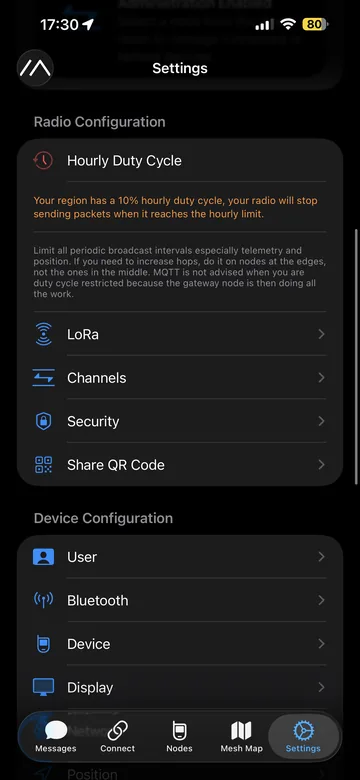</a>

---

## Moduli e pagine di configurazione (con screenshot)

???+ note "Device"
    Impostazioni del dispositivo: ruolo, radio, comportamenti base.

    

      <a href="../../assets/screenshots/ios/ios-device-01.png" class="glightbox" data-gallery="ios-cfg-device">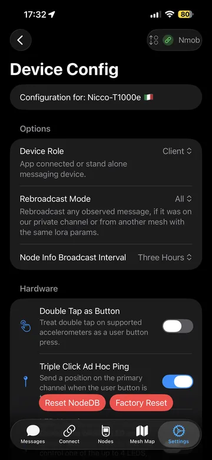</a>
      <a href="../../assets/screenshots/ios/ios-device-02.png" class="glightbox" data-gallery="ios-cfg-device">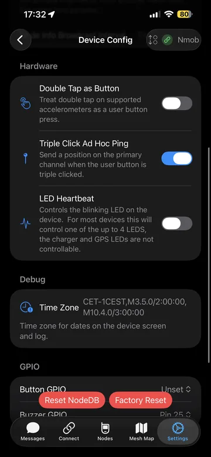</a>
      <a href="../../assets/screenshots/ios/ios-device-03.png" class="glightbox" data-gallery="ios-cfg-device">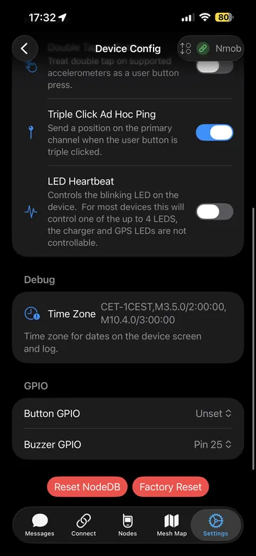</a>
      <a href="../../assets/screenshots/ios/ios-device-04.png" class="glightbox" data-gallery="ios-cfg-device">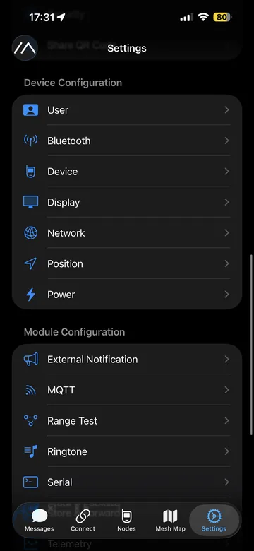</a>
    

???+ note "User"
    Nome, short name e parametri utente.

    

      <a href="../../assets/screenshots/ios/ios-user-01.png" class="glightbox" data-gallery="ios-cfg-user">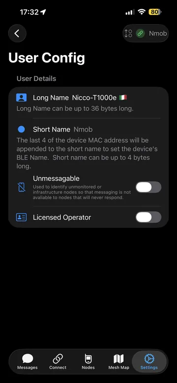</a>
    

???+ note "LoRa"
    Regione, modem, potenza e parametri radio (attenzione: qui puoi “spegnere” la rete se sbagli).

    

      <a href="../../assets/screenshots/ios/ios-lora-01.png" class="glightbox" data-gallery="ios-cfg-lora">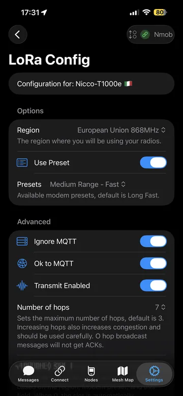</a>
      <a href="../../assets/screenshots/ios/ios-lora-02.png" class="glightbox" data-gallery="ios-cfg-lora">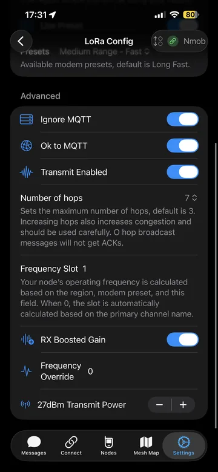</a>
    

???+ note "Position"
    GPS/posizione, condivisione e frequenza aggiornamenti.

    

      <a href="../../assets/screenshots/ios/ios-position-01.png" class="glightbox" data-gallery="ios-cfg-position">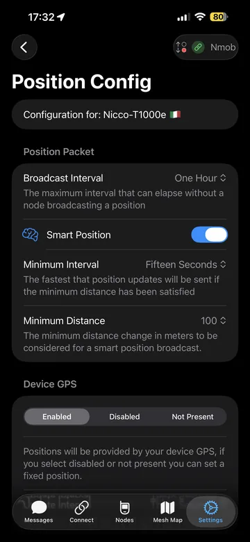</a>
      <a href="../../assets/screenshots/ios/ios-position-02.png" class="glightbox" data-gallery="ios-cfg-position">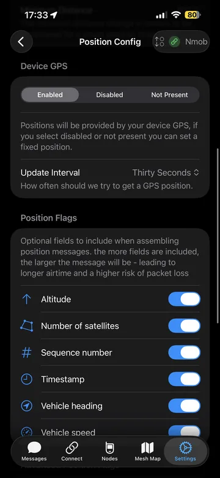</a>
      <a href="../../assets/screenshots/ios/ios-position-03.png" class="glightbox" data-gallery="ios-cfg-position">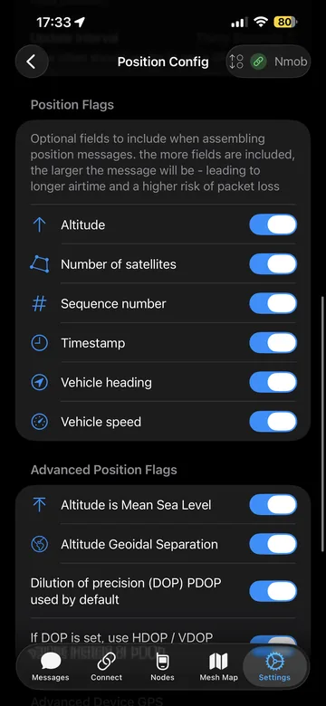</a>
      <a href="../../assets/screenshots/ios/ios-position-04.png" class="glightbox" data-gallery="ios-cfg-position">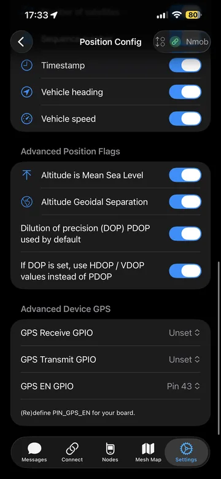</a>
      <a href="../../assets/screenshots/ios/ios-position-05.png" class="glightbox" data-gallery="ios-cfg-position">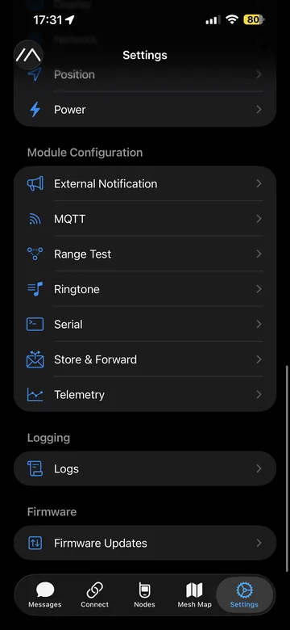</a>
    

???+ note "Security"
    Crittografia, chiavi, impostazioni di sicurezza.

    

      <a href="../../assets/screenshots/ios/ios-security-01.png" class="glightbox" data-gallery="ios-cfg-security">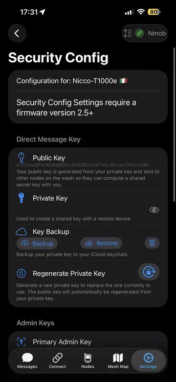</a>
      
      <a href="../../assets/screenshots/ios/ios-security-03.png" class="glightbox" data-gallery="ios-cfg-security">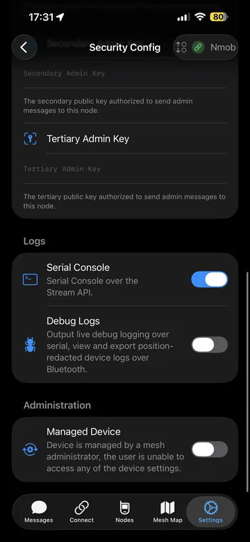</a>
    

???+ note "Network"
    Parametri di rete (quando presenti).

    

      <a href="../../assets/screenshots/ios/ios-network-01.png" class="glightbox" data-gallery="ios-cfg-network">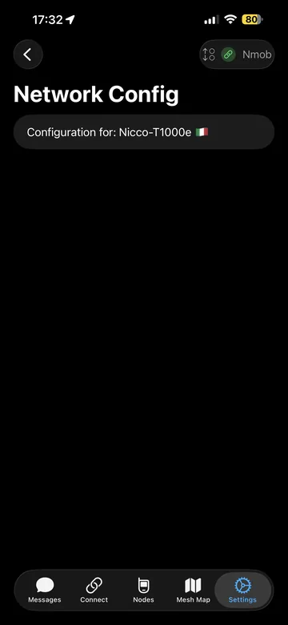</a>
    

???+ note "MQTT"
    Integrazione MQTT (proxy/client) e parametri broker.

    

      <a href="../../assets/screenshots/ios/ios-mqtt-01.png" class="glightbox" data-gallery="ios-cfg-mqtt">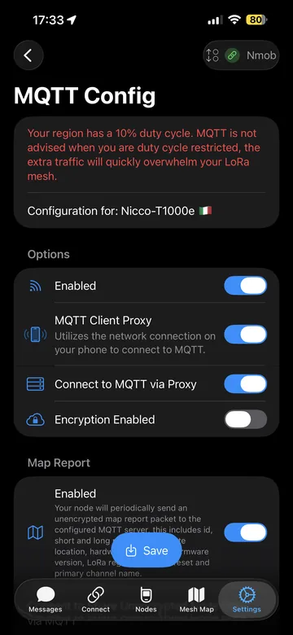</a>
      <a href="../../assets/screenshots/ios/ios-mqtt-02.png" class="glightbox" data-gallery="ios-cfg-mqtt">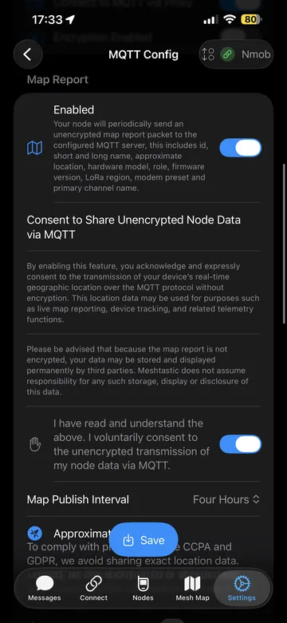</a>
      
      <a href="../../assets/screenshots/ios/ios-mqtt-04.png" class="glightbox" data-gallery="ios-cfg-mqtt">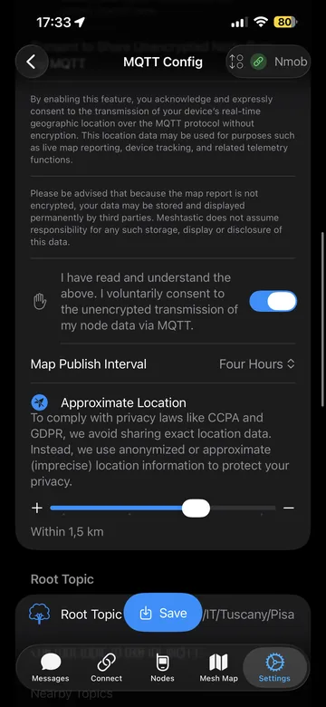</a>
      <a href="../../assets/screenshots/ios/ios-mqtt-05.png" class="glightbox" data-gallery="ios-cfg-mqtt">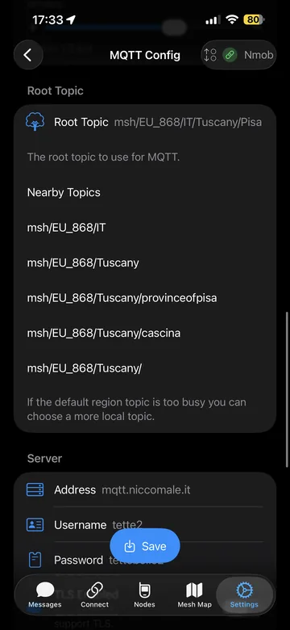</a>
      <a href="../../assets/screenshots/ios/ios-mqtt-06.png" class="glightbox" data-gallery="ios-cfg-mqtt">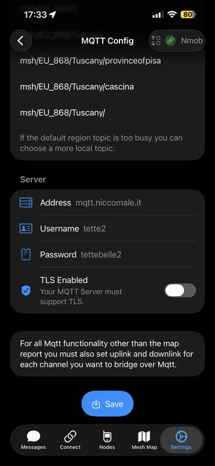</a>
    

???+ note "Telemetry"
    Telemetria: che cosa invii e con che frequenza.

    

      <a href="../../assets/screenshots/ios/ios-telemetry-01.png" class="glightbox" data-gallery="ios-cfg-telemetry">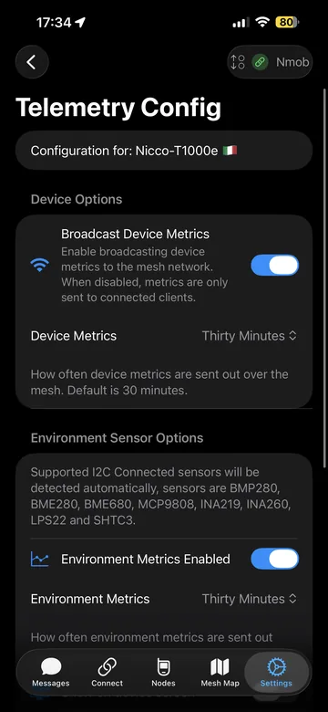</a>
      <a href="../../assets/screenshots/ios/ios-telemetry-02.png" class="glightbox" data-gallery="ios-cfg-telemetry">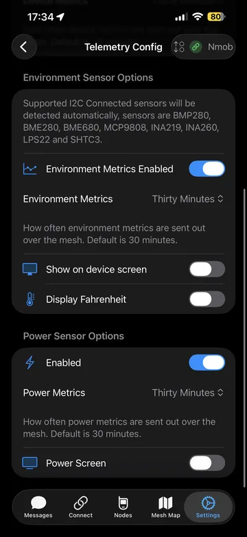</a>
    

???+ note "Store & Forward"
    Store & Forward: buffering/relè messaggi, utile in scenari specifici.

    

      <a href="../../assets/screenshots/ios/ios-store-forward-01.png" class="glightbox" data-gallery="ios-cfg-store-forward">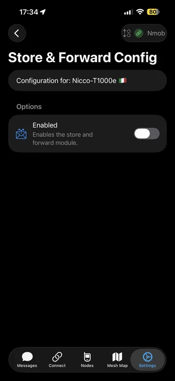</a>
      <a href="../../assets/screenshots/ios/ios-store-forward-02.png" class="glightbox" data-gallery="ios-cfg-store-forward">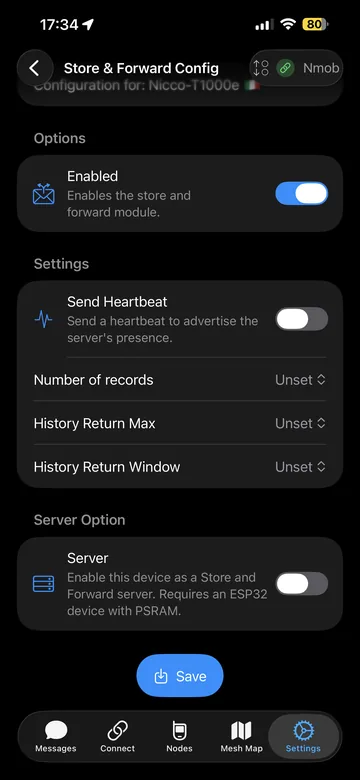</a>
    

???+ note "Serial"
    Serial: impostazioni porta e protocolli.

    

      <a href="../../assets/screenshots/ios/ios-serial-01.png" class="glightbox" data-gallery="ios-cfg-serial">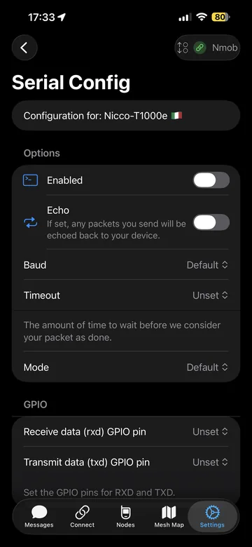</a>
      <a href="../../assets/screenshots/ios/ios-serial-02.png" class="glightbox" data-gallery="ios-cfg-serial">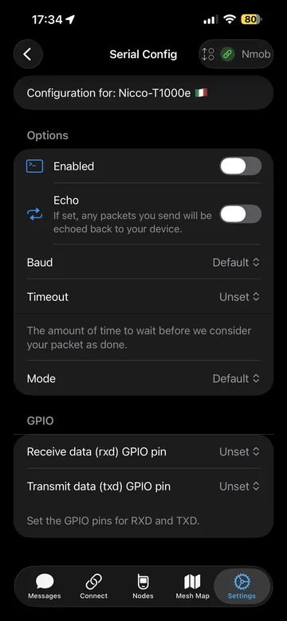</a>
    

???+ note "Display"
    Display: opzioni per schermo (quando presente).

    

      <a href="../../assets/screenshots/ios/ios-display-01.png" class="glightbox" data-gallery="ios-cfg-display">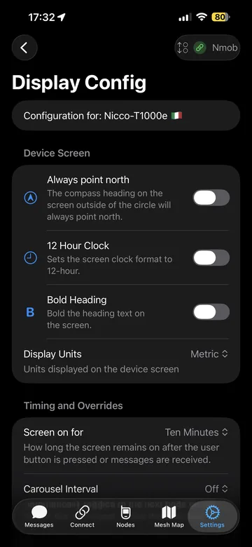</a>
      <a href="../../assets/screenshots/ios/ios-display-02.png" class="glightbox" data-gallery="ios-cfg-display">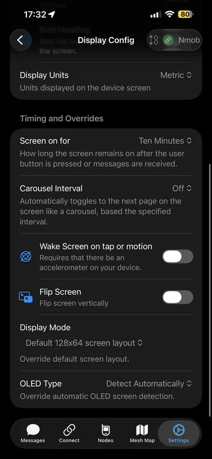</a>
    

???+ note "Power"
    Power: risparmio energetico e comportamento alimentazione.

    

      <a href="../../assets/screenshots/ios/ios-power-01.png" class="glightbox" data-gallery="ios-cfg-power">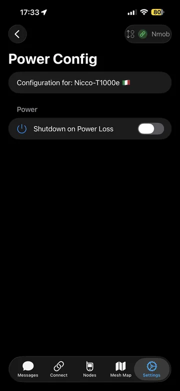</a>
    

???+ note "Range Test"
    Range Test: test copertura e qualità link.

    

      <a href="../../assets/screenshots/ios/ios-range-test-01.png" class="glightbox" data-gallery="ios-cfg-range-test">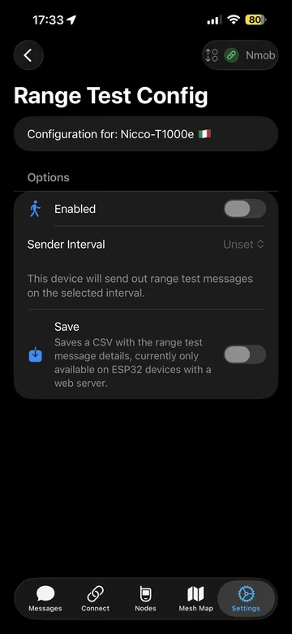</a>
    

???+ note "External Notifications"
    Notifiche esterne / integrazioni.

    

      <a href="../../assets/screenshots/ios/ios-external-notifications-01.png" class="glightbox" data-gallery="ios-cfg-external-notifications">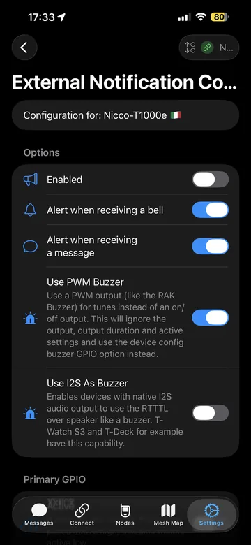</a>
      <a href="../../assets/screenshots/ios/ios-external-notifications-02.png" class="glightbox" data-gallery="ios-cfg-external-notifications">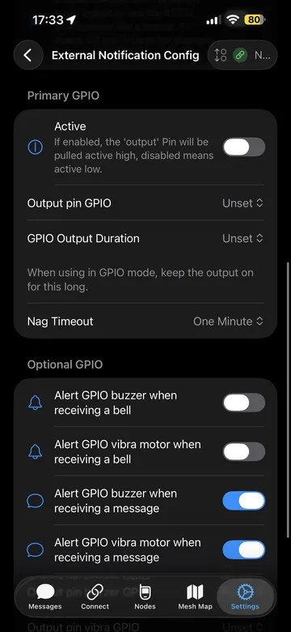</a>
      <a href="../../assets/screenshots/ios/ios-external-notifications-03.png" class="glightbox" data-gallery="ios-cfg-external-notifications">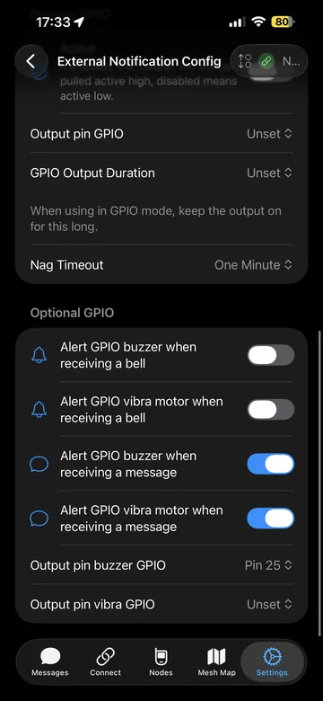</a>
    

???+ note "Ringtone"
    Suonerie/notifiche (iOS).

    

      <a href="../../assets/screenshots/ios/ios-ringtone-01.png" class="glightbox" data-gallery="ios-cfg-ringtone">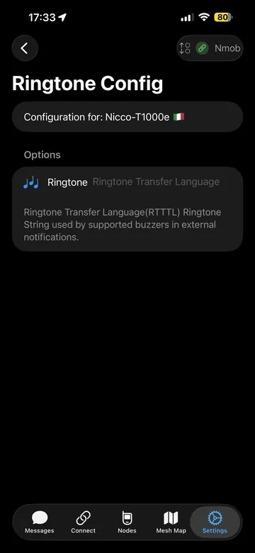</a>
    

???+ note "Remote admin"
    Amministrazione remota (funzioni avanzate).

    

      <a href="../../assets/screenshots/ios/ios-remote-admin-01.png" class="glightbox" data-gallery="ios-cfg-remote-admin">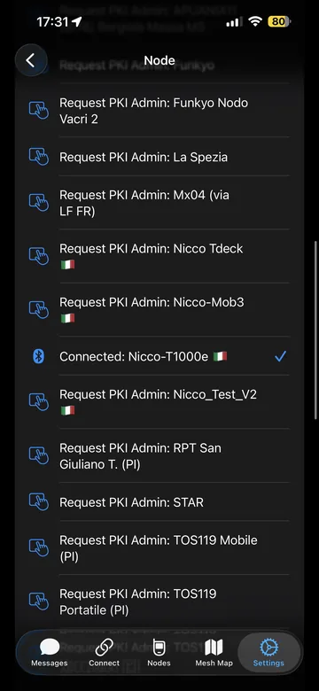</a>
    

