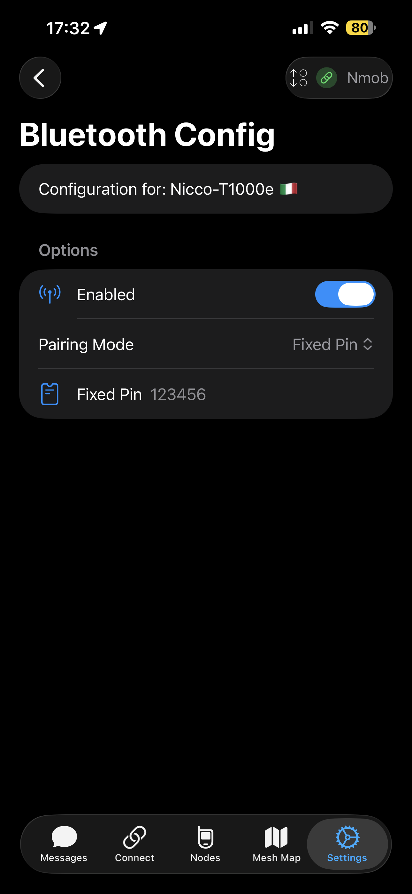

# iOS: connessione al nodo

Su iOS la connessione più comune è via **Bluetooth** (soprattutto su dispositivi portatili).  
Per nodi fissi puoi anche usare **Wi‑Fi** quando il tuo dispositivo/firmware lo supporta, ma il “default” resta Bluetooth.

---

## Passo‑passo (Bluetooth)

1. Apri l’app Meshtastic
2. Vai nella tab **Connect**
3. Avvia la scansione / seleziona il nodo
4. Attendi lo stato **Connected**

  
  

### Se non lo trova / non si connette

- Avvicina telefono e nodo (e allontanati da Wi‑Fi “affollati”)
- Disattiva/riattiva Bluetooth sul telefono
- Chiudi e riapri l’app
- Se hai cambiato firmware di recente: **“Dimentica”** il dispositivo e rifai pairing
- Riavvia il nodo

  

---

## Note pratiche

- Evita di avere **più telefoni** (iOS/Android) collegati contemporaneamente allo stesso nodo: a volte “litigano”.
- Se il nodo è in modalità “client Wi‑Fi”, spesso Bluetooth resta il modo più stabile per configurarlo.
