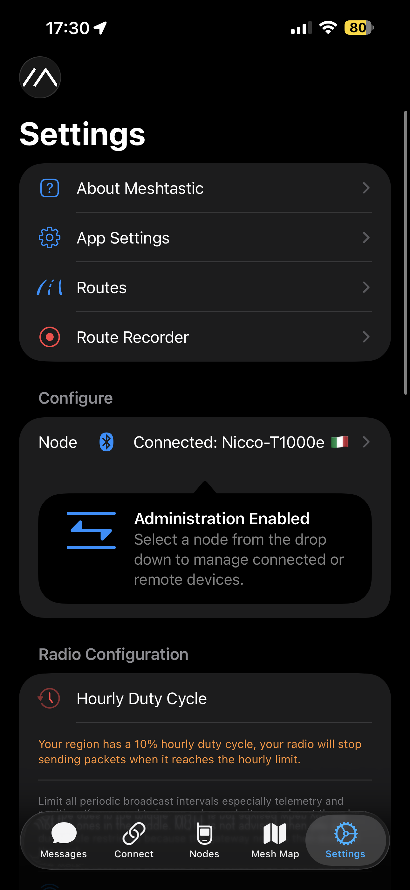
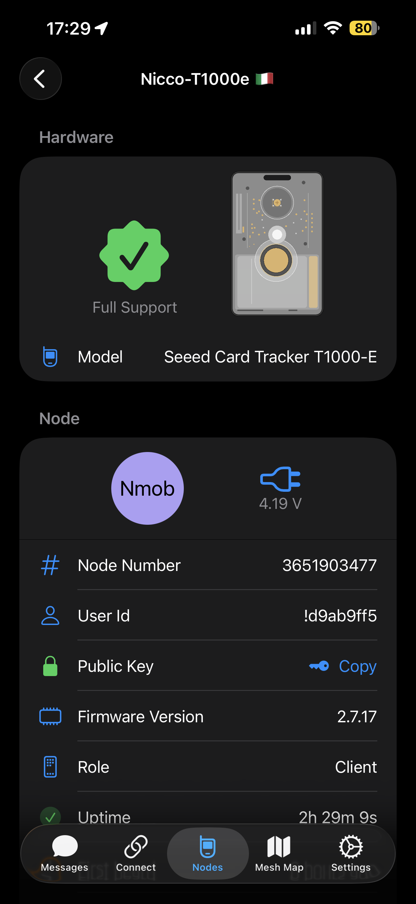

# iOS app (iPhone/iPad): overview

The Meshtastic iOS app is “radio‑first”: connect to a node, pick channels, chat, and check nodes/map.

---

## Main screens (tabs)

  
  
  
  
  

---

## Nodes and details

  
  
  
  

