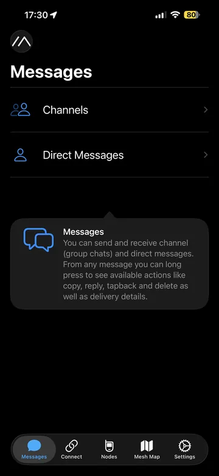
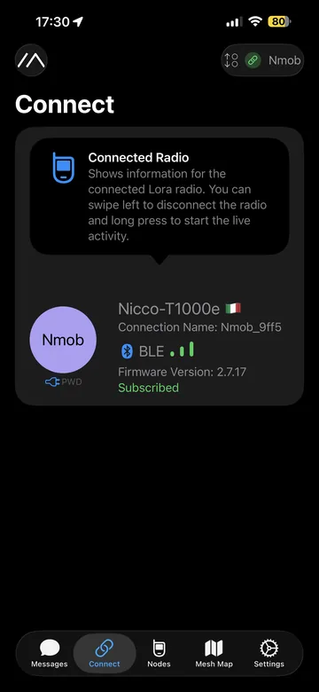
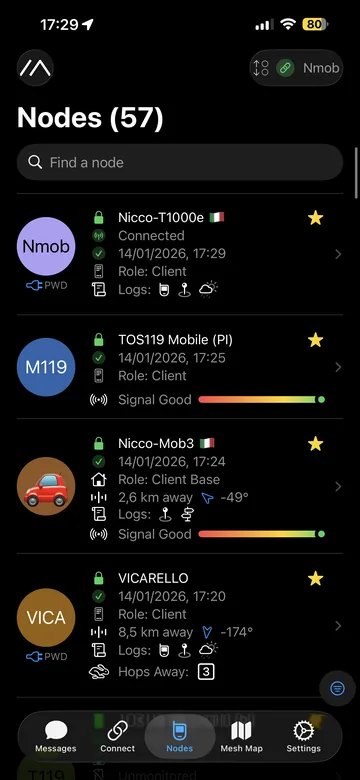
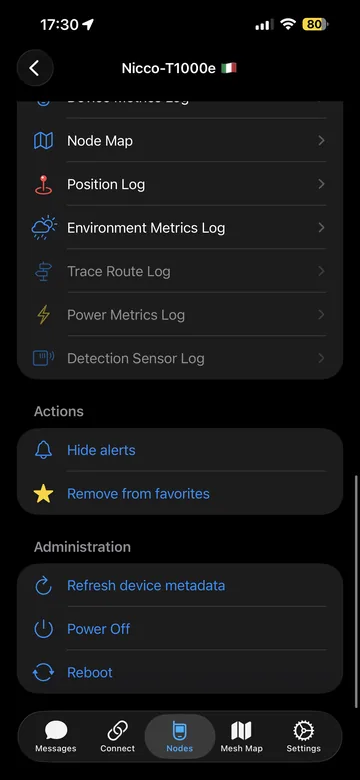
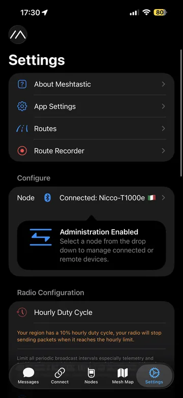
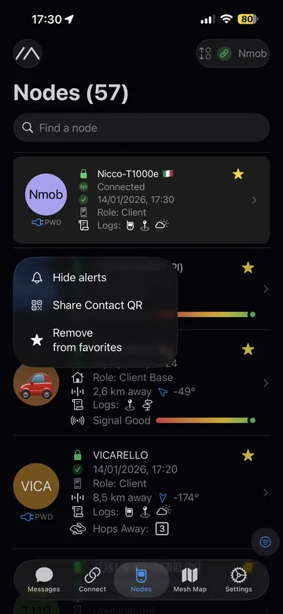
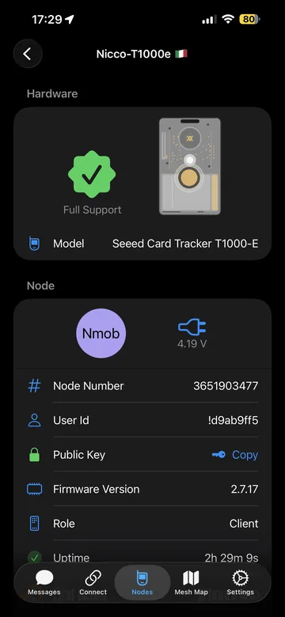
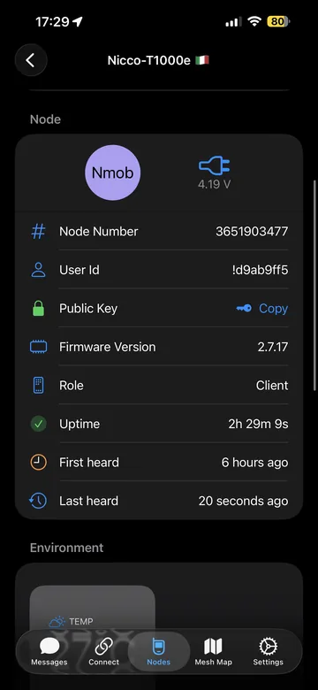

# App iOS (iPhone/iPad): panoramica

L’app Meshtastic su iOS è pensata per essere “radio‑first”: collegati al nodo, scegli canali, manda messaggi e controlla mappa/nodi.

---

## Schermate principali (tab)

  
  
  
  
  

---

## Nodi e dettagli

La tab **Nodes** ti fa vedere chi “senti” nella rete e ti dà dettagli utili (ultimo contatto, hop, hardware, ecc.).

  
  
  
  

---

## Dove andare dopo

- **Connessione**: come collegarsi al nodo (Bluetooth/Wi‑Fi)
- **Messaggi & canali**: chat, DM, QR canali
- **Mappa & offline**: Mesh Map e uso pratico
- **Configurazioni**: Settings e moduli
