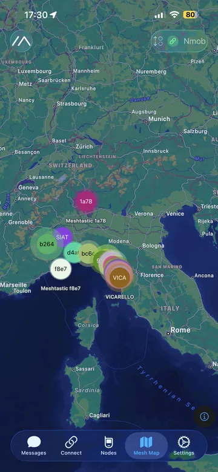

# iOS: mappa & offline

Su iOS la mappa usa **MapKit** (stile Apple Maps).  
Ti mostra nodi, posizione (se condivisa) e “tracce” utili per capire copertura e collegamenti.

---

## Mappa (Mesh Map)

  
  

## Consigli pratici

- Se non vedi posizioni: controlla in **Position** che la condivisione sia attiva (e che il nodo abbia GPS o posizione).
- La mappa è utile anche senza GPS: vedi comunque nodi e ultimi “heard”.
- Se vuoi usarla “tipo radio”, riduci la frequenza di aggiornamento posizione per non intasare il mesh.
