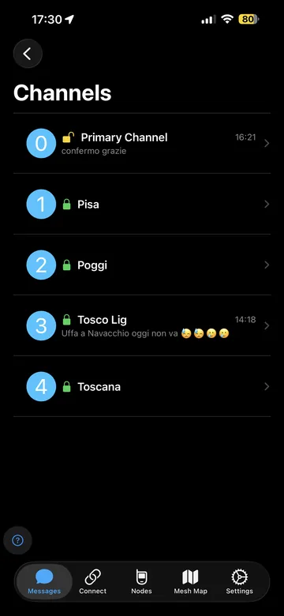
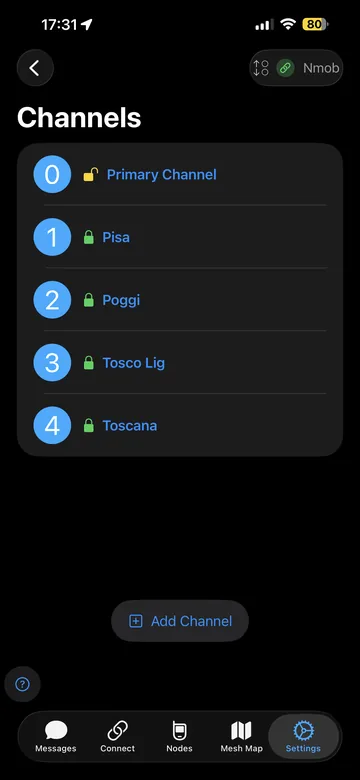
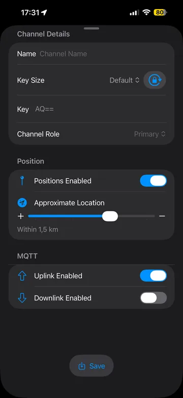
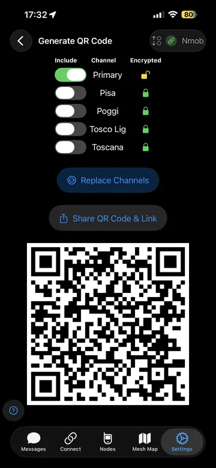
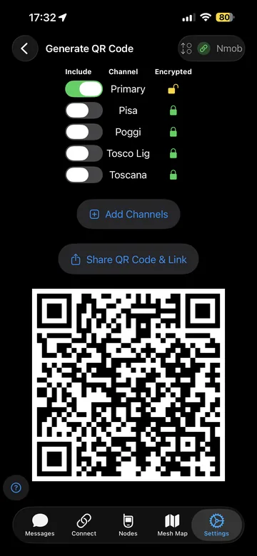

# iOS: messaggi & canali

Qui succede la magia: **chat di canale** (broadcast) e **messaggi diretti** (DM).  
Ricorda che Meshtastic non è “internet”: se la rete è congestionata o fai molti hop, i messaggi possono arrivare con ritardo.

---

## Messaggi (canali)

1. Apri la tab **Messages**
2. Scegli il **canale** (es. Primary / Pisa / Toscana…)
3. Scrivi e invia

  

## Messaggi diretti (DM)

I DM sono utili per parlare con un singolo nodo (es. per test o coordinamento).  
Se non vedi un contatto, assicurati che quel nodo abbia trasmesso di recente e che tu lo “veda” nella rete.

  

---

## Canali: impostazioni e QR

I canali sono “stanze” separate. Il punto chiave è la **chiave (PSK)**: chi non ha la PSK corretta non decifra i messaggi.

### Impostazioni canali

  
  
  

### Condividere canali (QR / link)

Comodissimo per far entrare qualcuno nel tuo canale senza impazzire a copiare PSK a mano.

  
  

