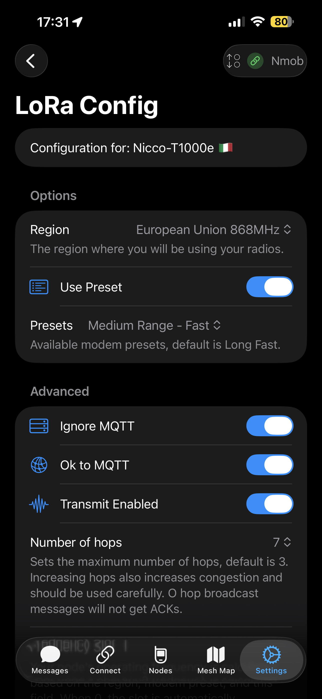
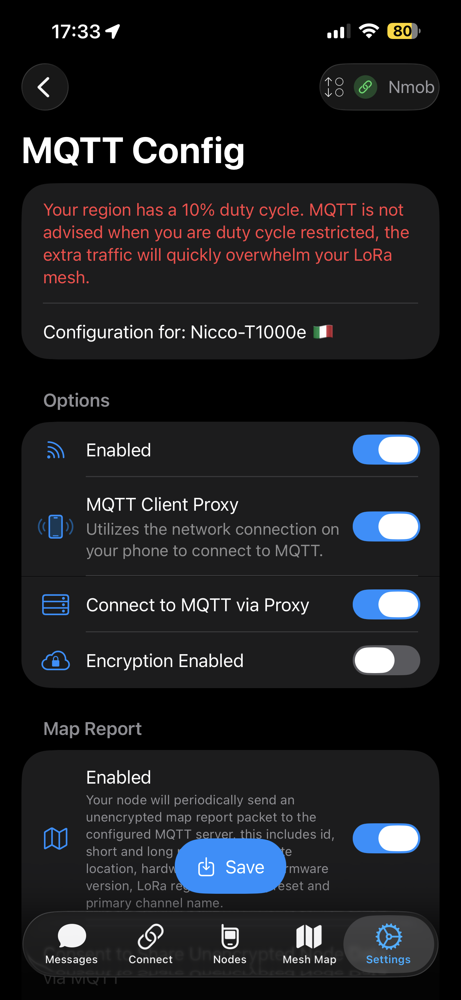
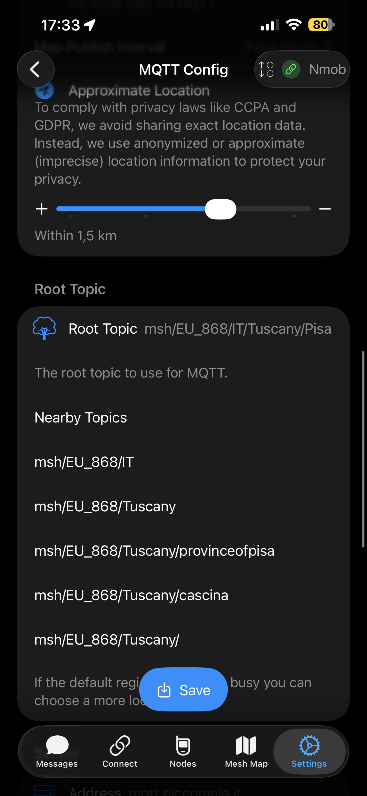

# iOS: troubleshooting

Quando qualcosa “non torna”, di solito è uno di questi tre: **connessione**, **regione/LoRa**, **canali/chiavi**.

---

## Non trova il nodo in Bluetooth

Checklist rapida:

- Bluetooth acceso sul telefono
- Nodo vicino (pochi metri per il primo pairing)
- App aggiornata
- Riavvio del nodo (sì, anche lui ha bisogno di una “reset therapy”)

  
  
  

---

## Si connette ma non vede nodi / non arrivano messaggi

Qui spesso il colpevole è **Regione/Preset LoRa** o **canali/PSK**.

- Controlla che la **regione** sia corretta (Italia = EU_868)
- Verifica il preset LoRa/Modem e la potenza (se tocchi cose a caso, addio copertura)
- Controlla che tu e gli altri siate sullo **stesso canale** e con la **stessa PSK** (se cifrato)

  
  

---

## Mappa vuota / posizioni non compaiono

- Il nodo deve avere **posizione** (GPS o posizione manuale) e deve essere autorizzato a condividerla
- Se la posizione arriva raramente, aumenta l’intervallo solo quanto serve (per non intasare la rete)

  
  
  
  

---

## MQTT non funziona (se lo usi)

- Host/porta/credenziali corrette
- Topic giusto (e regione corretta nel path)
- Se usi un broker pubblico: attenzione ai limiti e alla privacy

  
  
  

---

## Dopo un update firmware

- “Dimentica” il dispositivo in iOS e rifai pairing
- Se hai cambiato regione/preset: ripassa le impostazioni LoRa
