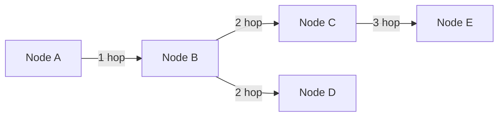

# Come funziona la mesh (routing, hop limit, trade-off)

Questa è la versione “dietro le quinte” di Meshtastic: **come si propagano i messaggi** e perché alcune scelte (preset, hop limit, posizione) fanno la differenza.

---

## Routing in due righe (senza magia)

Meshtastic usa un approccio **flooding controllato**:

- un nodo riceve un messaggio
- se può inoltrare, lo **rebroadcasta**
- ogni nodo evita duplicati e rispetta un **hop limit (TTL)**

Non c’è un “percorso fisso” come su Internet: i messaggi **possono attraversare più strade** e arrivare comunque.

---

## Hop limit: distanza vs rumore di rete

Più hop = più possibilità di arrivare lontano, ma anche:

- **più traffico radio**
- **più pacchetti duplicati**
- **meno capacità totale della rete**

È un classico trade‑off: aumenti la copertura, ma consumi banda e batteria.

---

## Preset LoRa: throughput vs robustezza

I preset LoRa determinano **quanto “tempo radio”** serve per un messaggio.

- preset lenti → più portata **ma** rete più lenta
- preset veloci → meno airtime **ma** portata inferiore

Se **aumenti hop limit** *e* usi **preset lenti**, il traffico può crescere molto.

---

## Diagramma: propagazione con hop limit

Se l’hop limit è impostato a **2**, il nodo **E** non riceverà il messaggio.

---

## Regole pratiche (in 20 secondi)

- **Posizione vince**: un nodo alto e libero può valere più di 10 hop.
- **Preset moderati**: riducono congestione e aumentano l’affidabilità reale.
- **Hop limit sensato**: spesso **3** è già più che sufficiente.

---

## Quando spingere e quando no

**Spingere (hop/preset più “lunghi”)** se:
- hai pochi nodi distanti
- serve coprire una dorsale o area ampia

**Non spingere** se:
- la rete è densa
- hai molto traffico (chat, telemetria, sensori)
- i messaggi arrivano con ritardo
